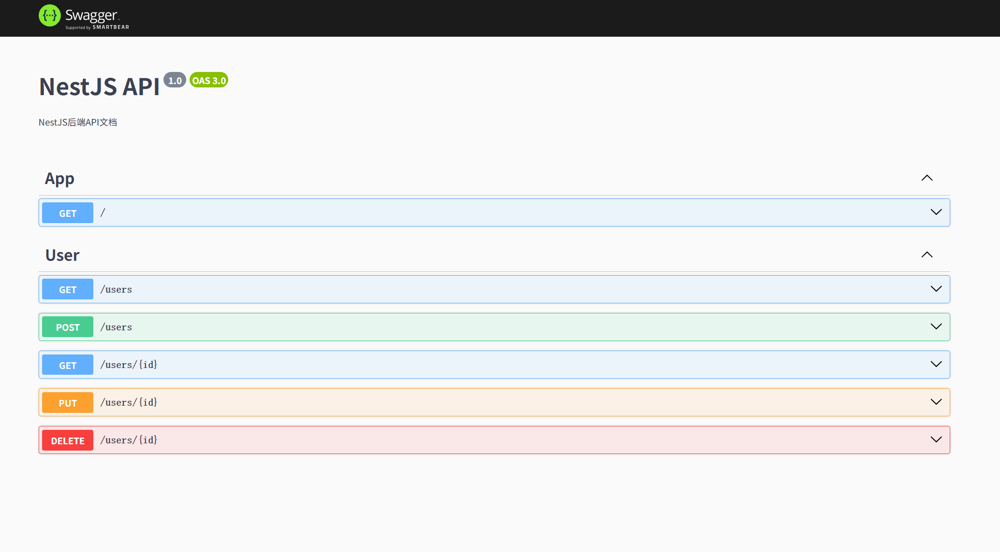

# 项目名称

这是一个基于NestJS的后端项目模板，使用TypeORM进行数据库操作。
- 提供用户管理功能，包括创建、更新、删除和查询用户。
- 使用TypeORM进行数据库操作，支持分页查询。
- 提供RESTful API接口，使用Swagger进行文档化。


---




## Installation

```bash
$ npm install
```

## Running

```bash
# development
$ npm run start

# watch mode
$ npm run start:dev

# production mode
$ npm run start:prod
```

## Test

```bash
# unit tests
$ npm run test

# e2e tests
$ npm run test:e2e

# test coverage
$ npm run test:cov
```

## 技术栈
- NestJS
- TypeORM
- MySQL
- Swagger